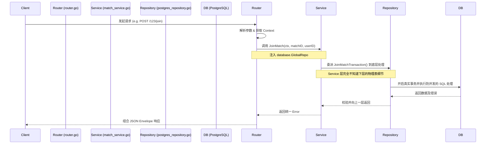

# Backend Architecture & Implementation Status: fb-backend

## 一. 架构调用流程 (Archi-Flow)

在经历了数据库访问层的依赖倒置(Dependency Injection)重构之后，系统现在的调用链路异常清晰，并符合经典的**数据解耦分层架构**。典型的接口请求（如报名比赛 `POST /:id/join` 或即将完善的创建球队）数据流向如下：

---

## 二. 目前已详细实现的部分 (Implemented)

### 1. 启动入口与环境隔离 (Infrastructure & Cmd)

* **配置读取**: 配合 `config.yaml`（未来） 或环境变量实现。
* **数据库组件初始化**: \`cmd/main.go\` 调用 \`database.Init(dsn)\` 实例化 PgSQL `Repository` 数据连接操作集合，并保存在全局变量 `GlobalRepo` 中，供路由装配层使用。

### 2. 数据库抽象接口 Repository 模式 (DB Abstract Layer)

完全屏蔽了上层建筑对底层持久化层的物理感知，通过 `common/database/repository.go` 定义业务防腐抽象：

* **PgSQL 的极具体实现 (`postgres_repository.go`)**: 充分利用了 \`Gorm.WithContext()\` 与 \`Transaction()\` 实现了支持跨协程的真实长连接事务。并在本项目高并发防超卖和复杂关联查询等场景担任核心主力角色。

### 3. 数据层核心业务拦截实现 (Data-Layer Specific Business)

这两个复杂数据事务操作已经写好在了 Repo 里：

* **`CreateTeamWithCreator` (建队事务)**:
  * 保证建立 `Team` 实体并同时插入拥有者关系到辅助多对多表 `TeamMember` 时，两张表的数据完整性。如果插入队长权限时出错，建队的步骤自动回滚。
* **`JoinMatchTransaction` (报名抢票高并发处理)**:
  * 首先开启闭包事务。使用了悲观锁 \`clause.Locking{Strength: "UPDATE"}\` 防止同时读取到旧座位容量导致**系统超卖**。
  * 做了**幂等处理**：如果这个人已经报名过，拦截多次重复报名避免脏数据。
  * 精准判断真实被占用的状态是不是 "CONFIRMED"。

### 4. 非常薄的业务服务层 (Thin Service Layer)

* 现在的 `TeamService` 和 `MatchService` 的工作异常简单，主要负责充当控制器与底层 DB 之间的胶水层。依赖注入了 Repo ，隔离了原先直接耦合 \`Gorm.DB\` 的风险。

### 5. 实体结构体与映射机制 (Gorm Entities)

* `internal/model/` 包含如 \`user.go\`, \`team.go\`, \`match.go\`, \`booking.go\` 等所有实体的强类型 Go Struct，以及配套的 \`gorm tags\`。

---

## 三. 简单说明尚未实现的部分 (Unimplemented / TODO)

根据《开发执行计划.md》的需求，以下是等待施工的代码空白区：

1. **所有的查询接口**：目前只完成了创建/写入部分的闭环，并没有完成类似于：
   * 获取发现页：分页筛选 `matches` 比赛的接口。
   * 获取 `Team Details` 并采用预加载 `Preload` 读取其所有 `Members` 和队长的读取接口。
   * 查询自身所有 Booking 等只读方法。
2. **路由的 Handler 封装未搭建完整 (Day 4 等)**：
   * 目前仅跑通了 `/:id/join` 报名的基础 Controller ，尚缺少类似于 `POST /teams` 的新建球队 API 以及 HTTP 传参 JSON 解析和参数校验环节。
3. **取消报名逻辑 (Booking Cancelation)**：
   * 涉及到不仅需要把当前排队人的状态改成 \`CANCELED\` ，最复杂的是还需要运用到 DB 长事务，去排队列表寻找一名 \`WAITING\` 成员将他**递补转正**的功能，同时预埋发短信事件。
   * 批量赛后结账状态。
4. **Day 28: Auth 与拦截体系**：
   * 尚未实现利用 \`golang-jwt/v5\` 基于标头 Bearer 发放且安全无状态识别 userID 的机制，登录、登出以及路由白名单黑名单体系未闭环。

---

## 四. MVP 35 天计划薄弱点分析与改进优化建议 (Plan Weaknesses & Improvements)

基于对原先执行计划以及本项目重业务形态的整体盘点，由于放弃了 NoSQL 并确立了以 PostgreSQL 为主干的开发模式，当前旧版本的计划中存在几个“逻辑漏洞或风险设计”，急需在后续迭代中引起注意并及时补救：

### 1. 并发模型瓶颈风险（排队与退票算法不足）

* **当前计划弱点**: Day 11 要求“有用户取消后，用 Order(\"created_at ASC\") 取最早的一条 Waiting 转正”。但是，如果在多用户并发退票或并发报名（如抢到一个稀有位置变成了 Waiting）瞬间，用简单的 Order+Limit 可能导致**死锁或者相同库存被错发给多个 Waiting 会员**。
* **改进建议 (解决方案)**: 在 `Repository` 层必须为“排队转正”的查询加上**悲观锁加排他锁 (`FOR UPDATE SKIP LOCKED`)**。这是只有类似 Postgres 这样强大的关系型数据库才能带来的安全队列保护伞，直接从数据底层避开应用层的读写竞争分发冲突。

### 2. 软删除策略的缺失 [✅ 已完成]

* **当前计划弱点**: 在所有 Schema 设计中，尚未明确规定**逻辑删除（Soft Delete）**的应用。预约订单系统（Booking）、比赛历史（Match）和重要账户数据在任何情况下都不应当进行不可逆的物理 `DELETE / DROP` 而导致后续风控对账和历史追查发生断档。
* **改进建议**: Gorm 自带完美无缝兼容的 `DeletedAt` 特性。建议修改计划 Day 2 实体映射阶段时，让相关的所有核心模型集成引入 `gorm.DeletedAt` 结构作为时间戳哨兵。

### 3. 系统时区管理缺位 [✅ 已完成]

* **当前计划弱点**: App 主设定为“预订比赛场地等时间极具敏感性的服务”，但是目前前后端的时间写入、查询、跨度判断并没有关于 Timezone (时区) 约束。在容器化或者跨区云端部署运行在 UTC 标准时容易导致直接显示偏差或倒计时逻辑发生漂移。
* **改进建议**: 在 `cmd/main.go` 初始化链路增加针对性的时区预检查和固定，或由接口强制采用 ISO8601 UTC Timestamp 再丢给端侧（React）按日本或者各客户端本地时间各自渲染解析。

### 4. 缺乏统一参数校验（Validator）拦截 [✅ 已完成]

* **当前计划弱点**: 计划中仅仅提及了解析读取结构体（Bind），并在处理诸如批量生成多条行程数组体时，严重缺乏前防线的表单合法性筛查。
* **改进建议**: HTTP `handler` 层在入场时就需要配置集成 Gin 原生的 `github.com/go-playground/validator/v10` 及 custom validation （例如：“结束时间不能早于开始时间”、“批量预约数组不能为空”、“球队昵称违禁词” 等防备措施），一旦有脏数据在业务路由网关处即退回 400 Bad Request，而非直接丢进 Repository 层报错。

### 5. 路线B：真实商业化运营边缘场景 (Edge Cases & 防查漏补缺) [⏳ 待处理 - B路线]

* **鸽子惩罚机制 (防恶意取消)**：临近开场（如24小时内）取消报名，系统应自动扣除 `User.Reputation` 信用分，低于阈值禁止风控系统拦截报错，约束用户契约精神。
* **候补转正的“超时未响应”锁票问题**：不管是拼手速还是候补通知接替，都必须引入类似电影票的“15分钟付款/确认倒计时”机制，超时未操作自动流转给下一位候补者，防止占坑。
* **严格的球队权限校验 (越权防范)**：在如发比赛、踢人等敏感接口处，必须通过 Middleware 或 Service 层严格校验发起请求的 userID 是否属于该 TeamID 的 Owner 或 Admin。
* **赛后分润与支付确认 (AA制防白嫖)**：记录由 `UNPAID` 转 `PAID` 的闭环，并增加赛后一键催款（发送短信/端内通知提醒）的辅助功能。

---

## 五. 今日开发进展总结 (Today's Progress)

今天我们在 MVP 的“底层设施、模型优化与首批核心接口”维度上取得了极具生产力的突围式进展：

1. **依赖环境安全落地 (`.env` & godotenv)**:
   * 顺利引入环境变量管理机制，彻底切断了机密密码与 DSN 硬编码在源码里的安全隐患。
2. **纯粹的 Postgres 容器环境运行 (Docker)**:
   * 告别了纸上谈兵，在一台独立的 Docker 容器里成功拉起了 PG15 数据库，并且配置了 `database.go` 打通了持久层通信桥梁。
3. **Data Seeding & 自动迁移 (Day 5 场地测试库)**:
   * 编写执行了 `cmd/seed/main.go`。Gorm 魔术般的 `AutoMigrate` 瞬间拉起 7 张支持软删除的健壮物理表。
   * 自动化插入了 10 条真实东京都（涉谷/江东）的精细球场（Venues）测试数据。
4. **批量赛事发布接口闭环 (Day 8: `CreateMatchBatch`)**:
   * 基于纯正的数据库解耦事务 (`Transaction` 闭包)，实现了带有时间防重和完整出错回滚保护的批量发局功能，并在 `router.go` 接口处配备了 Validator 护城河拦截器。
5. **极度深度的 Model 重塑与注释填充**:
   * 为所有的结构体打满了详尽至极的中文业务注释，明确预留字段使用场景（如 `SubTeam`, `HasBibs`）。
   * 基于最新的 UGC 共建球场产品理念，反向优化扩展结构体关联。清理多余字段，加入 `User` 到 `Teams` 的 Many2Many 反向查询阵列，确保后期极少出现伤筋动骨的 DDL 变更。
